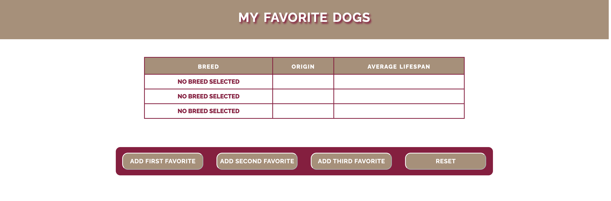

# MY FAVORITE DOGS

## A Demo Mini-Project to Demonstrate the use of the JavaScript call() Method

###### **Fig. 1: Opening Screen of Project**

The object of this demo is to employ the **call()** method that function
objects expose to extract properties from objects and assign them
dynamically to text nodes in the **Document Object Model (DOM).**

As shown in Figure 1 above, the opening screen presents the user with a table
containing rows of 3 favorite dog breeds. The rows of the table are populated
only by the default text of **NO BREED SELECTED** in the leftmost **BREED**
column.

The first 3 buttons in the button bar below the table populate each table row
with values for the three columns&mdash;**BREED**, **ORIGIN** and
**AVERAGE LIFESPAN**.

The fourth button resets the table to its original state.

For further information, please consult the associate article,
**_A Quick Look at the JavaScript call() method_** on Medium.com
